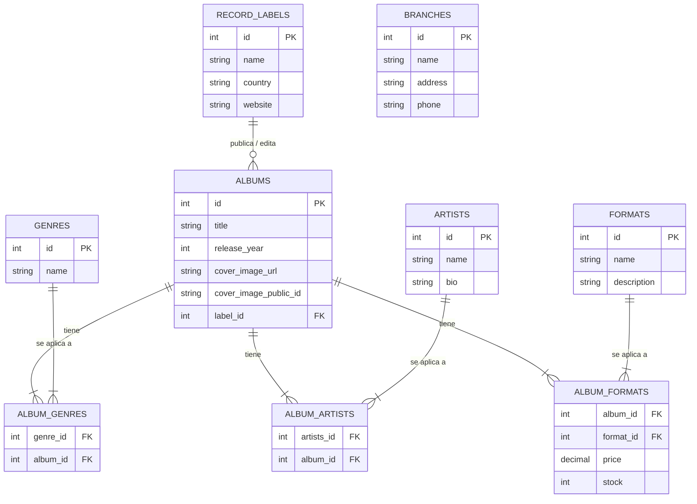
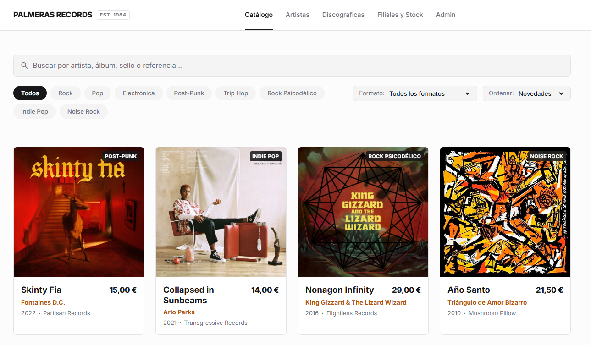

# 🌴 Palmeras Records — Catálogo Musical y API de Gestión de Inventario

[](https://fastapi.tiangolo.com/)
[](https://www.python.org/)
[](https://www.sqlite.org/)
[](https://cloudinary.com/)
[](https://opensource.org/licenses/MIT)

Plataforma integral para la gestión y comercialización de música física (vinilos, casetes y CDs) de sellos independientes. Este proyecto ofrece una **API REST relacional de alto rendimiento desarrollada con FastAPI** junto a una interfaz web modular mediante componentes web nativos, control de inventario por tiendas filiales y almacenamiento optimizado de carátulas en la nube.

---

## 📋 Tabla de contenidos

1. [Características principales](#-características-principales)
2. [Stack tecnológico](#-stack-tecnológico)
3. [Diagrama Entidad-Relación (DER)](#-diagrama-entidad-relación-der)
4. [Instalación y puesta en marcha](#-instalación-y-puesta-en-marcha)
5. [Variables de entorno (.env.example)](#-variables-de-entorno-envexample)
6. [Endpoints de la API y parámetros de consulta](#-endpoints-de-la-api-y-parámetros-de-consulta)
7. [Capturas de pantalla](#-capturas-de-pantalla)
8. [Recursos citados y referencias](#-recursos-citados-y-referencias)
9. [Autoría y licencia](#-autoría-y-licencia)

---

## ✨ Características principales

* **Catálogo musical con filtrado dinámico:** Búsqueda en vivo por término, género musical, país del sello discográfico y ordenación multicriterio.
* **Gestión relacional completa (CRUD):** Administración integral de álbumes, artistas, sellos discográficos, géneros, tiendas filiales, formatos físicos y existencias.
* **Almacenamiento multimedia con Cloudinary:** Subida de carátulas en tiempo real mediante `multipart/form-data`, persistiendo la URL segura y el identificador público (`public_id`) para modificaciones y borrados.
* **Trazabilidad de inventario y precios:** Control granular de existencias y precios por formato físico en cada álbum mediante relaciones muchos a muchos (N:M).
* **Documentación interactiva automática:** Generación automática de especificaciones en vivo con OpenAPI / Swagger y ReDoc.

---

## 🛠 Stack tecnológico

### Backend
* **Lenguaje:** Python 3.10+
* **Framework web:** FastAPI
* **Servidor ASGI:** Uvicorn
* **ORM y base de datos:** SQLAlchemy / SQLite
* **Validación de esquemas:** Pydantic v2
* **Gestión de archivos multimedia:** Cloudinary Python SDK

### Frontend (Arquitectura modular desacoplada)
* **Estructura y componentes:** HTML5 semántico, Custom Web Components (`<main-header>`)
* **Lógica cliente:** JavaScript Vanilla (módulos ES)
* **Estilos y diseño:** CSS moderno, CSS Grid, Flexbox, variables de diseño (tokens)
* **Iconografía:** Google Material Symbols Outlined

---

## 🗄 Diagrama Entidad-Relación (DER)

A continuación se detalla el esquema relacional de la base de datos implementado con SQLite y SQLAlchemy[cite: 14]:



> **Archivo visual del esquema:** El diagrama exportado de la base de datos está disponible en `docs/diagrama2.jpg`[cite: 14].

---

## 🚀 Instalación y puesta en marcha

Sigue estos pasos para clonar el proyecto, preparar el entorno virtual y ejecutar la aplicación en local:

### 1. Clonar el repositorio
```bash
git clone [https://github.com/TEAM-4-Palmeras-En-La-Mancha/Palmera_records_frontend.git](https://github.com/TEAM-4-Palmeras-En-La-Mancha/Palmera_records_frontend.git)
cd Palmera_records_frontend
```

### 2. Crear y activar el entorno virtual
En Windows (PowerShell):
```powershell
python -m venv venv
.\venv\Scripts\Activate.ps1
```

En Linux o macOS:
```bash
python3 -m venv venv
source venv/bin/activate
```

### 3. Instalar las dependencias del proyecto
```bash
pip install --upgrade pip
pip install -r requirements.txt
```

### 4. Configurar las variables de entorno
Crea tu archivo local `.env` a partir de la plantilla:
```bash
cp .env.example .env
```

### 5. Iniciar la base de datos y el servidor backend
```bash
uvicorn main:app --reload --host 127.0.0.1 --port 8000
```
La API quedará escuchando peticiones en: `http://127.0.0.1:8000`

---

## 🔐 Variables de entorno (`.env.example`)

Configura los siguientes valores en tu archivo `.env` en la raíz del proyecto:

```env
# ==============================================================================
# CONFIGURACIÓN DE VARIABLES DE ENTORNO (.env.example)
# ==============================================================================

# Entorno de la aplicación
ENVIRONMENT=development
DEBUG=True
PORT=8000
HOST=127.0.0.1

# Configuración de base de datos relacional
DATABASE_URL=sqlite:///./palmeras_records.db

# Configuración de Cloudinary (almacenamiento de imágenes)
# Obtenidas en la consola de [https://cloudinary.com](https://cloudinary.com)
CLOUDINARY_CLOUD_NAME=tu_cloud_name_aqui
CLOUDINARY_API_KEY=tu_api_key_aqui
CLOUDINARY_API_SECRET=tu_api_secret_aqui

# Orígenes CORS permitidos (separados por coma)
ALLOWED_ORIGINS=http://localhost:5500,[http://127.0.0.1:5500](http://127.0.0.1:5500),http://localhost:3000,[http://127.0.0.1:8000](http://127.0.0.1:8000)
```

---

## 📡 Endpoints de la API y parámetros de consulta

La documentación interactiva en vivo se encuentra disponible en:
* **Swagger UI:** [http://127.0.0.1:8000/docs](http://127.0.0.1:8000/docs)
* **ReDoc:** [http://127.0.0.1:8000/redoc](http://127.0.0.1:8000/redoc)

### 1. Catálogo y Álbumes (`/albums`)

#### `GET /albums/`
Devuelve la lista paginada de álbumes con filtros combinados y ordenación.

| Parámetro de consulta | Tipo | Obligatorio | Valor por defecto | Descripción |
| :--- | :--- | :---: | :---: | :--- |
| `search` | `string` | No | `null` | Filtra por título de álbum o nombre de artista. |
| `genre_id` | `integer` | No | `null` | Filtra lanzamientos que pertenezcan al identificador del género. |
| `format_id` | `integer` | No | `null` | Filtra álbumes disponibles en el formato físico indicado. |
| `sort_by` | `string` | No | `"title"` | Campo de ordenación (`"title"`, `"year"`, `"price"`, `"created_at"`). |
| `order` | `string` | No | `"asc"` | Dirección de ordenación (`"asc"` para ascendente o `"desc"` para descendente). |
| `skip` | `integer` | No | `0` | Desplazamiento inicial de registros para la paginación. |
| `limit` | `integer` | No | `20` | Límite máximo de registros devueltos por página. |

**Ejemplos de peticiones:**
```http
GET /albums/?search=Fontaines&sort_by=year&order=desc
GET /albums/?genre_id=2&format_id=1&limit=10&skip=0
```

#### `GET /albums/label/{label_id}`
Obtiene el resumen de todos los álbumes publicados por un sello discográfico específico[cite: 4].

---

### 2. Sellos Discográficos (`/record-labels`)

| Método | Endpoint | Descripción |
| :--- | :--- | :--- |
| `GET` | `/record-labels/` | Devuelve la lista completa de sellos discográficos[cite: 4]. |
| `GET` | `/record-labels/countries` | Devuelve la lista única de países para los filtros del catálogo[cite: 4]. |
| `POST` | `/record-labels/` | Da de alta un nuevo sello discográfico. |
| `DELETE` | `/record-labels/{id}` | Elimina un sello discográfico por su identificador. |

**Ejemplo de petición:**
```http
GET /record-labels/countries
```

---

### 3. Subida multimedia (`/upload`)

#### `POST /upload/cover`
Sube una carátula a Cloudinary y devuelve su URL pública segura y su identificador de recurso.

* **Tipo de contenido:** `multipart/form-data`
* **Cuerpo de la petición:** `file`: `UploadFile` (archivo de imagen `.jpg`, `.png`, `.webp`)

**Respuesta (`201 Created`):**
```json
{
  "secure_url": "[https://res.cloudinary.com/palmeras/image/upload/v1714000000/albums/skinty_fia.webp](https://res.cloudinary.com/palmeras/image/upload/v1714000000/albums/skinty_fia.webp)",
  "public_id": "albums/skinty_fia"
}
```

---

### 4. Artistas, Formatos Físicos y Sucursales (`/artists`, `/formats`, `/branches`)

| Método | Endpoint | Descripción |
| :--- | :--- | :--- |
| `GET` | `/artists/` | Devuelve todos los artistas junto a sus álbumes asociados[cite: 4]. |
| `GET` | `/formats/` | Lista los formatos físicos disponibles (`Vinilo LP`, `CD`, `Cassette`). |
| `GET` | `/branches/` | Devuelve las sucursales físicas y sus datos de contacto. |

---

## 📸 Capturas de pantalla

   

---

## 📚 Recursos citados y referencias

* **[FastAPI Framework](https://fastapi.tiangolo.com/):** Framework web de alto rendimiento para el desarrollo de APIs en Python.
* **[Cloudinary Python SDK](https://cloudinary.com/documentation/python_integration):** Plataforma para el procesamiento y alojamiento de imágenes en la nube.
* **[SQLAlchemy ORM](https://www.sqlalchemy.org/):** Toolkit SQL y mapeador objeto-relacional para Python.
* **[Google Material Symbols](https://fonts.google.com/icons):** Sistema de iconografía utilizado en componentes del catálogo, botones y navegación.
* **[Tipografía Inter](https://rsms.me/inter/):** Fuente tipográfica optimizada para interfaces de usuario.
* **[Mermaid.js](https://mermaid.js.org/):** Herramienta de diagramado declarativo para renderizado de esquemas en Markdown.

---

## 👥 Autoría y licencia

Proyecto desarrollado por el equipo **Palmeras en La Mancha**:

* **Sara Rodríguez** 
* **Esperanza Aragón**
* **Abel Marrero**
* **Ángel Martínez**
* **Sebastián Carlos Pro**
